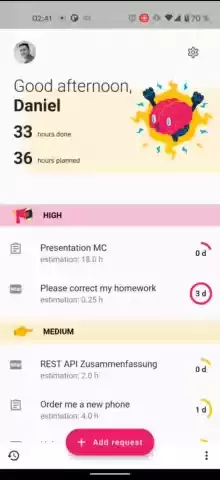
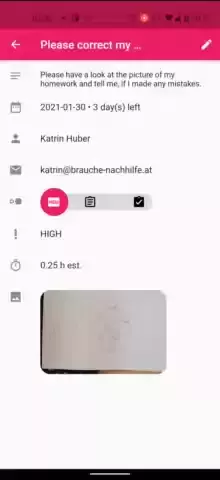

# requests

Stay on-top of your todos.

## Background

For a university assignment a fellow student and I have created an advanced todo app. Similar to GitHub Issues, people can add items to your list. You get notified about it, can accept/decline and track the state.

The main focus of this project was to experiment with Flutter, GraphQL and sensors.

## Preview

  
